# Smart Mock Server - Architecture Diagrams

## High-Level Concept

```mermaid
flowchart LR
    Spec[📄 OpenAPI<br/>Spec] --> Mock[🤖 Smart Mock<br/>Server]
    Mock <--> LLM[🧠 Local LLM<br/>Ollama]
    Client[💻 Your App] --> Mock
    Mock --> JSON[📦 Intelligent<br/>JSON Response]
    JSON --> Client
    
    style Spec fill:#fff9c4
    style Mock fill:#f3e5f5
    style LLM fill:#fce4ec
    style Client fill:#e1f5fe
    style JSON fill:#e8f5e9
```

## Simple Flow Diagram

## Detailed Architecture Overview

## Request Flow Sequence

## Component Details

## Scenario Engine State Machine

## Cache Strategy

## OpenAPI Spec Processing

## Deployment Architecture

## Technology Stack

## Security Considerations

These diagrams provide a comprehensive view of the Smart Mock Server architecture, showing:

1. **High-Level Architecture**: Overall system components and their relationships
2. **Request Flow**: Detailed sequence of how requests are processed
3. **Component Pipeline**: The response generation pipeline
4. **State Management**: How scenarios affect response generation
5. **Caching Strategy**: How responses are cached and retrieved
6. **OpenAPI Processing**: How specifications are parsed and indexed
7. **Deployment Options**: Various deployment configurations
8. **Technology Stack**: Mind map of all technologies used
9. **Security Considerations**: Privacy and security benefits

You can include these diagrams in your article or documentation. They render beautifully in any Markdown viewer that supports Mermaid (GitHub, GitLab, many documentation tools, etc.).